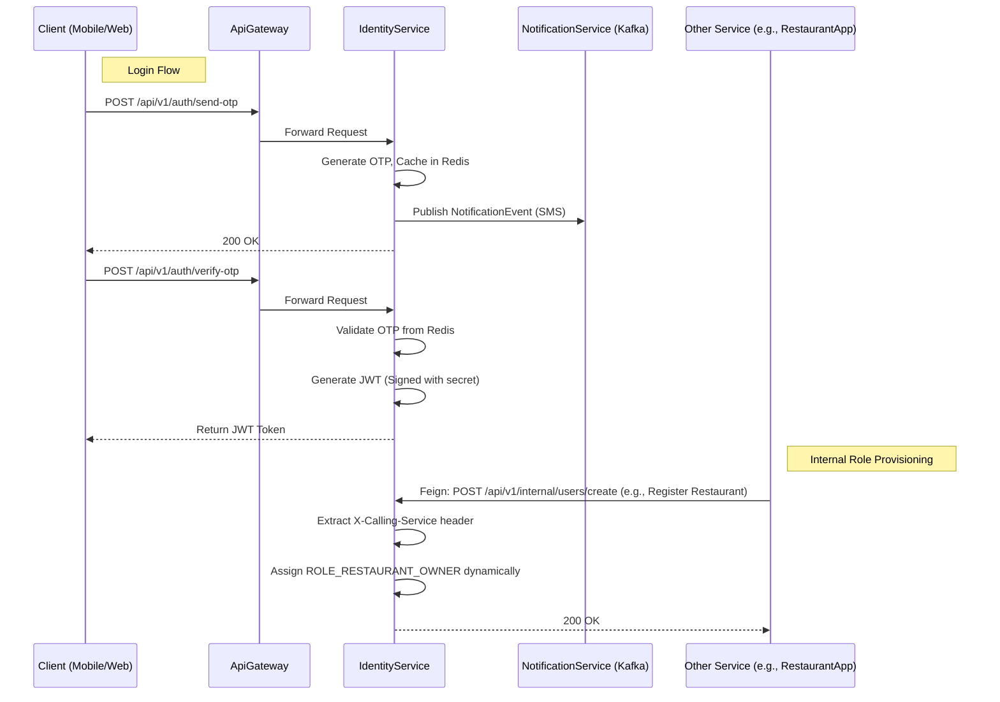

# IdentityService Architecture

The IdentityService manages authentication internally via OTP and issues standard JWTs which are then strictly parsed by the ApiGateway for all subsequent requests.

## Detailed Sequence Diagram

